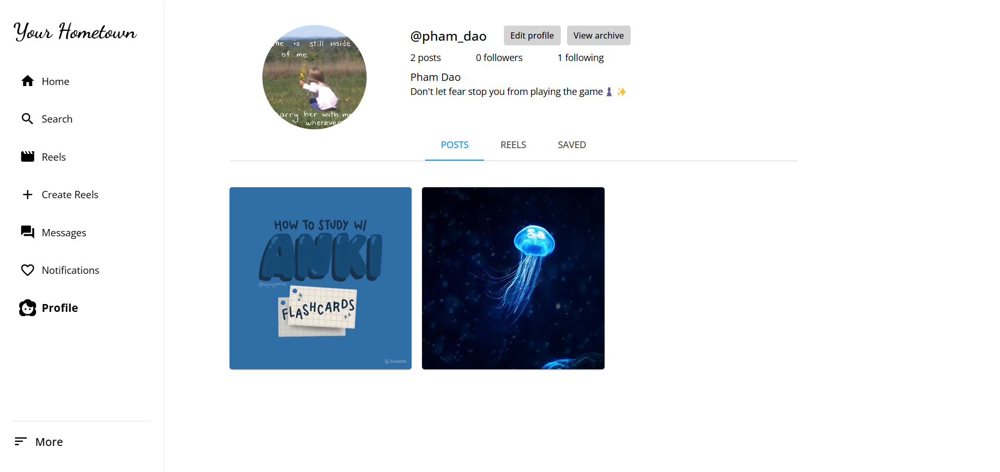
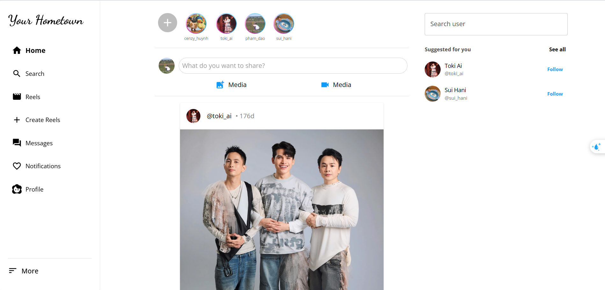
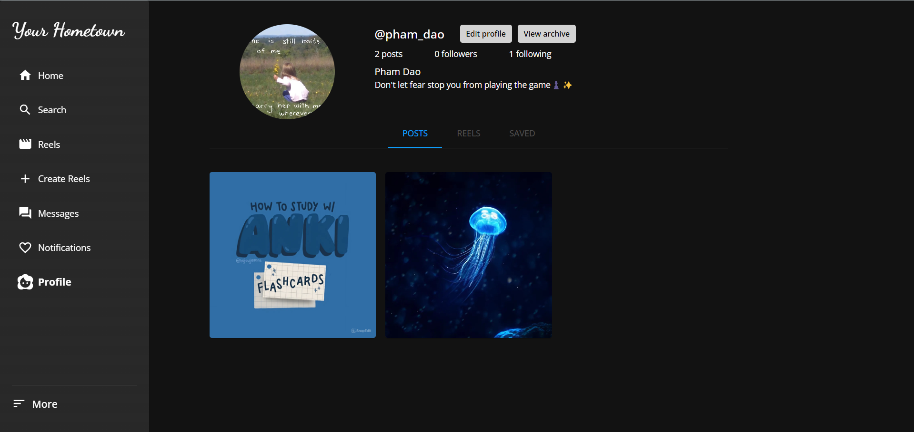
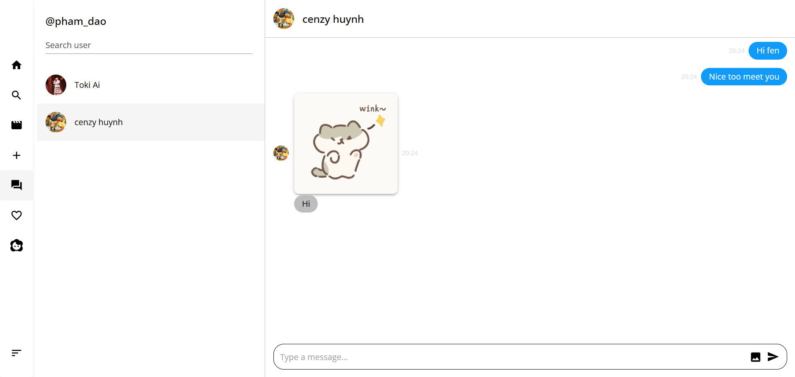
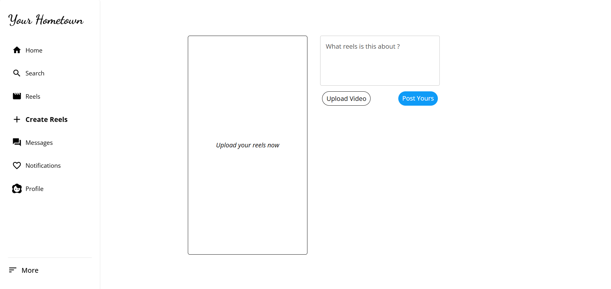
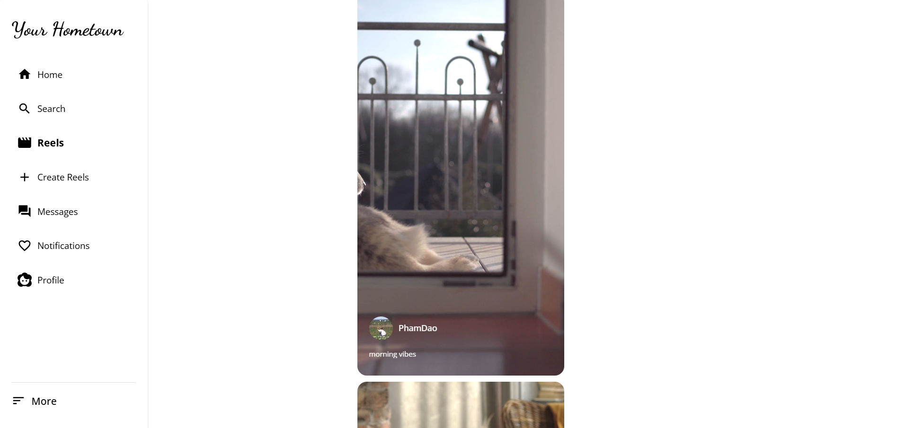
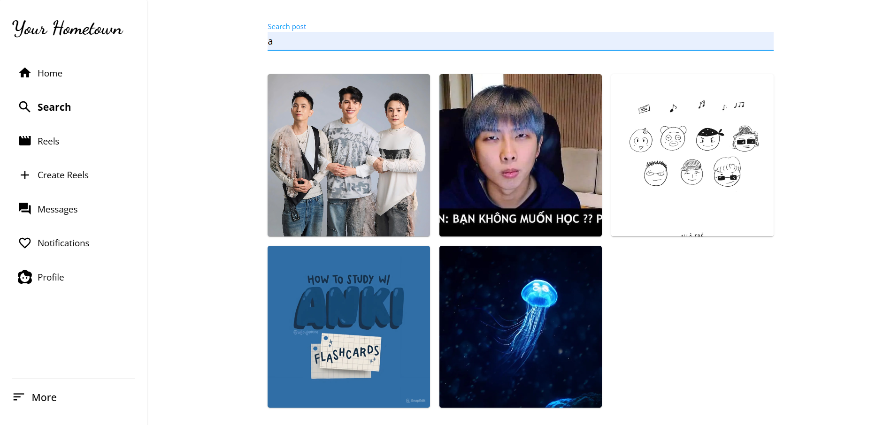

# Social Media Web Application

A modern social media web application built with React, TypeScript, and Tailwind CSS.

## Demo

Here are some screenshots of the application:

### Authentication & Profile




### Main Features





### Content Creation & Discovery





## Features

- User Authentication
- Real-time Chat
- Dark/Light Theme Support
- Responsive Design
- User Profiles
- Post Creation and Interaction
- Friend System

## Tech Stack

- React
- TypeScript
- Tailwind CSS
- Context API for State Management
- Socket.IO for Real-time Communication

## Project Structure

```
src/
├── components/     # Reusable UI components
├── context/       # React Context providers
├── hooks/         # Custom React hooks
├── layouts/       # Page layouts
├── pages/         # Page components
├── services/      # API and service functions
├── types/         # TypeScript type definitions
└── utils/         # Utility functions
```

## Getting Started

### Prerequisites

- Node.js (v14 or higher)
- npm or yarn

### Installation

1. Clone the repository

```bash
git clone [repository-url]
```

2. Install dependencies

```bash
npm install
# or
yarn install
```

3. Start the development server

```bash
npm run dev
# or
yarn dev
```

4. Open [http://localhost:5173](http://localhost:5173) in your browser

## Environment Variables

Create a `.env` file in the root directory with the following variables:

```env
VITE_API_URL=your_api_url
VITE_SOCKET_URL=your_socket_url
```
